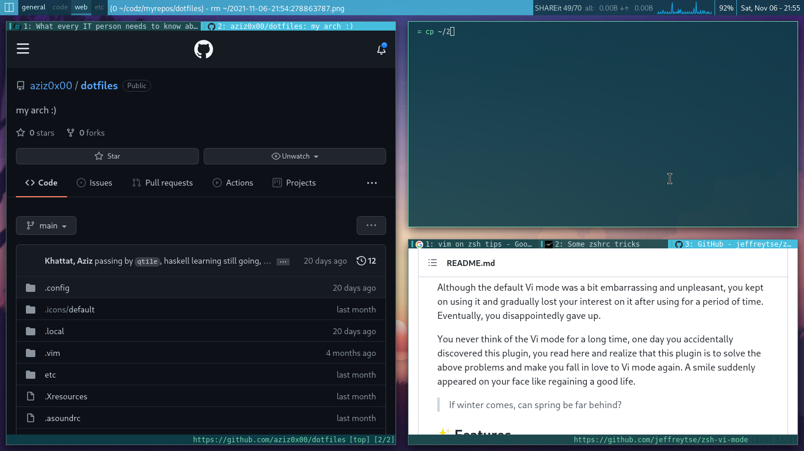

# MY HOUSE <3

## Yo, what is this, 4e chenhou??

this is my own custom arch setup (aka. rice), feel free to explore yourself in the code <3
i spend big time writing and configuring stuff, u think im gon let it ez for u to have such? haha u kiddin xd
there are some cool projects hidden there.. ENJOY EXPLORING, i hope u learn somth and use it for good <3

## Thanks should be given and gratitude
I really thank from the bottom of my heart everybody who made these programs I use, they really made the FOSS community, those guys really made computers freedom beautiful for everybody. from the bottom of my heart, thanks guys <3
now anyone can live with freedom and peace without the lack of aestheticism (graphically and programmatically) and efficiency which are even incredibly much better than the non-FOSS ones in most cases.

## software I love (no particular order, we all complete each other)
- `openbox`
- `alacritty` <3 (I wish they add rtl and cmd-output to clipboard)
- `[n]vim`
- `rofi`
- `lf` <3
- `zsh` <3
- `ArchLinux` <3
- `mpv`
- `xmonad`
- `htop`
- `pywal`
- `tmux`
- `sxiv`
- `qutebrowser` <3
- `picom`
- `zathura`
- `pwninit`
and so so much more, I love y'all <3.

## stuff I did here I didn't see nowhere else:
- separate shell history files switcher
- e4kar loop
- the custom dynamic terminal title'ing
- clipboards editor on vim keybinding, direcly saves modification to clipboard (but there's an issue here, vim does things that its untold to do (metrouche), when decoding a base64 and saving it, a weird thing happen, ig its about encoding..)

## Screenshot

