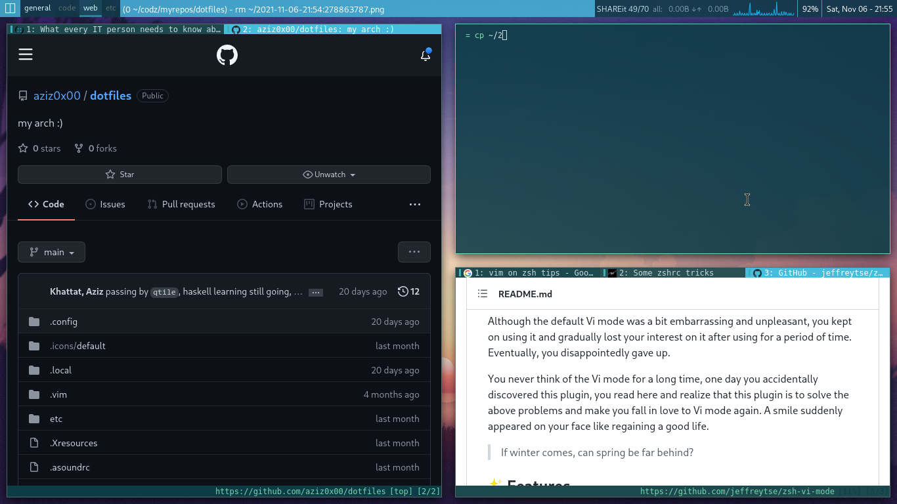

# there's no place like ::1

Personal dotfiles for my Linux setup.

This repo is mostly a backup and reference for my daily environment: Hyprland,
Fish, tmux, Neovim, Waybar, and a handful of small scripts for desktop workflow.

## Stack

- **Desktop:** Hyprland
- **Bar:** Waybar
- **Lock/wallpaper:** Hyprlock, Hyprpaper
- **Shell:** Fish
- **Terminal workflow:** tmux, Kitty, Ghostty
- **Editor:** Neovim
- **Browser:** qutebrowser, Brave
- **Menus:** rofi, tofi, fzf
- **Clipboard/screenshot:** cliphist, wl-clipboard, grim, slurp
- **Other daily tools:** lf, mpv, zathura

## Workflow Notes

- Fish starts Hyprland automatically from `tty1`; other TTY logins attach to a
  tmux session.
- `SUPER+P` opens the app launcher with `rofi`.
- `SUPER+V` opens clipboard history with `tofi`, decodes the selected `cliphist`
  entry, and copies it back with `wl-copy`.
- `SUPER+O` opens a `tofi` picker for screenshots, PDFs, images, and docs, then
  launches the selected file with `xdg-open`.
- `Print` starts a region screenshot with `slurp` + `grim`; `Shift+Print`
  captures the full screen.
- After taking a screenshot, `tofi` asks whether to copy it to the clipboard,
  save it under `~/screenshots`, or discard it.
- `custom-scripts/tmux-sessionizer` picks a project with `fzf`, switches tmux to
  it, and gives it a matching Fish history file.
- Hyprland has special workspaces for scratch terminals, [AI](https://github.com/aziz0x00/chat.sh)/dev sessions, htop,
  and background tasks.

## Layout

- `hypr/` - Hyprland, Hyprpaper, Hypridle, Hyprlock, portal startup
- `waybar/` - Waybar config, style, and scripts
- `fish/` - Fish config, prompt, aliases, binds, functions, environment
- `tmux/` - tmux config
- `nvim/` - Neovim Lua config
- `custom-scripts/` - small desktop and shell helpers
- `etc/` - system-level config snippets
- `pkglist.txt` - package list from the current machine

## Install

There is no polished installer yet. `install.sh` is still a TODO, so treat this
repo as configs to inspect and copy or symlink manually.

## Screenshot

## Acknowledgments
> I really thank from the bottom of my heart everybody who made these programs I use, they really made the FOSS community, those guys really made computers freedom beautiful for everybody. from the bottom of my heart, thanks guys <3 now anyone can live with freedom and peace without the lack of aestheticism (graphically and programmatically) and efficiency which are even incredibly much better than the non-FOSS ones in most cases. \
> —  [Me, Oct 17 2021](https://github.com/aziz0x00/dotfiles/commit/5d3903197afdbffb6537f3caffb745fb6dfa641e)

Selam ✌️.
