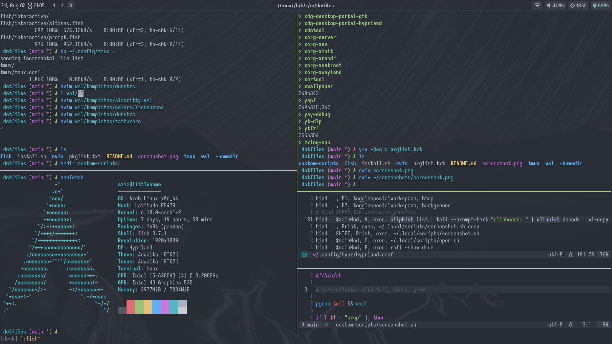

# there's no place like ::1

## Intro

I keep my computer setup here that I use for programming and offsec, so I don't lose it when the hardware is lost and to share it with anyone who might finds it useful
You can also see _the software stack_ I use in bottom-right of the screenshot

## Thanks should be given and gratitude
I really thank from the bottom of my heart everybody who made these programs I use, they really made the FOSS community, those guys really made computers freedom beautiful for everybody. from the bottom of my heart, thanks guys <3
now anyone can live with freedom and peace without the lack of aestheticism (graphically and programmatically) and efficiency which are even incredibly much better than the non-FOSS ones in most cases.

## My most favorite programs
### productivity
- `qtile` never had to look back at i3, you can check how I organize my configs, any suggestions are super welcome
- `alacritty` <3 (I wish they add rtl and cmd-output to clipboard)
- `neovim` you can check my nvim directory to see more
- `tmux` quick and organized workflow, bam bam bam (theprimeagen voice) everywhere
- `fish` I think fish is really underrated by many, it should be more used, I believe *it's way much better* than every shell out there
- `qutebrowser` great browser <3
### others
- `lf`
- `mpv`
- `pywal`
- `sxiv`
- `picom`
- `zathura`
- `pwninit`
and so so much more, thanks alot alot alot for everyone behind them <3.

## projects that came on the side of builing this
- separate shell history files switcher (at ./fish/functions/history_sessions_switcher.fish)
- switch tmux sessions and set history file and working directory depending automatically (at ./~homedir/.local/scripts/tmux-4ever)
- TODO: a keybinding to edit clipboards in nvim in the scartchpad terminal

## Screenshot

I hope you found something useful here :p
Selam ✌️
